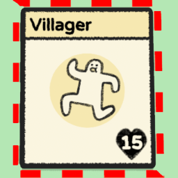

# Stacklands Idle Villager

Adds a red border around an idle food producer or villager.

# Settings

|Option|Default|Description|
|--|--|--|
|HighlightVillagers|true|Highlights idle villagers|
|HighlightFoodProducers|Garden, FishingSpot, FishingTrap, Greenhouse|The food producers to highlight when idle.  Set to None to not highlight food producers.

|Food Producer Value|Note|
|--|--|
|None| Do not highlight any producers.|
|Garden | Farms and Gardens|
|FishingSpot | |
|FishingTrap | |
|Greenhouse ||

# Change Log

## 1.3.0
Added Fishing Trap, Greenhouse as food producers.
Changed the config option "HighlightGardens" to "HighlightFoodProducers"
with a comma delimited list of food producers.
Fixed animation occurring in Cardopedia screens.

## 1.2.0
Added Fishing Spot as a food producer.

## 1.1.1
Added idle highlight for food producers.
Added configuration options.

## 1.0.1
Initial Release

