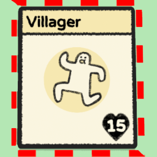

# Stacklands Idle Villager

Adds a red border around idle food producers or villagers.

# Settings
The mod options includes settings to enable or disable the highlighting of the following idle cards:

* Villagers
* Farms and Gardens
* Fishing Spots
* Fishing Traps
* Greenhouses
* Poop

# Change Log
## 2.2.2
* Compatibility for 2000 DLC

## 2.2.1
* Fixes issue where the mod "Stack to Bottom" would cause the borders to be white instead of red.  Thank you to Steam user Big Sword for reporting this.

## 2.2.0
* Added Poop (Thank you Steam user DASH666 for reporting)
* Added localization

## 2.1.0
* Fixes Villagers from DLC not being included.  Young/old, etc.

## 2.0.0
* Support for Steam Workshop.

# Source
* Source can be found at https://github.com/NBKRedSpy/StacklandsIdleVillager
